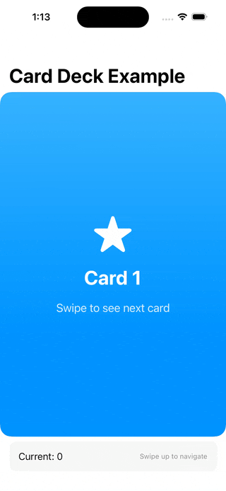

# CardDeckView

スワイプナビゲーションとドラッグジェスチャーを備えたインタラクティブなカードデッキを提供するSwiftUIライブラリです。



## 機能

- **カードスタックナビゲーション**: スムーズなアニメーションでカードをスワイプ
- **インタラクティブなドラッグジェスチャー**: カードナビゲーションの自然なタッチ操作
- **位置トラッキング**: バインディングサポートで現在のカード位置を監視
- **カスタマイズ可能なスタイリング**: 内蔵のカード背景モディファイアとシャドウ
- **SwiftUIネイティブ**: SwiftUIコンポーネントのみで構築
- **iOS & macOS対応**: iOS 18+ および macOS 15+ に対応

## 必要条件

- iOS 18.0+ / macOS 15.0+
- Swift 6.2+
- Xcode 16.0+

## インストール

### Swift Package Manager

Swift Package Managerを使用してCardDeckViewをプロジェクトに追加：

1. Xcodeで、File → Add Package Dependencies を選択
2. リポジトリURL: `https://github.com/noppefoxwolf/CardDeckView` を入力
3. 使用するバージョンを選択

または `Package.swift` に追加：

```swift
dependencies: [
    .package(url: "https://github.com/noppefoxwolf/CardDeckView.git", from: "1.0.0")
]
```

## 使い方

### 基本的な実装

```swift
import SwiftUI
import CardDeckView

struct ContentView: View {
    @State private var currentPosition: String? = nil
    
    var body: some View {
        CardDeckView {
            ForEach(0..<5) { index in
                CardView(title: "カード \(index + 1)")
                    .tag("\(index)")
            }
        }
        .stackPosition(tag: $currentPosition)
    }
}

struct CardView: View {
    let title: String
    
    var body: some View {
        VStack {
            Text(title)
                .font(.largeTitle)
                .fontWeight(.bold)
        }
        .frame(maxWidth: .infinity, maxHeight: .infinity)
        .background(Color.blue.gradient)
        .foregroundColor(.white)
        .stackCardBackground {
            Color.blue.opacity(0.3)
                .shadow(radius: 10)
        }
        .cornerRadius(20)
    }
}
```

### 高度な例

```swift
struct AdvancedCardDeck: View {
    @State private var currentPosition: String? = nil
    
    var body: some View {
        NavigationStack {
            CardDeckView {
                ForEach(cards) { card in
                    CustomCardView(card: card)
                        .tag(card.id)
                }
                
                CompletionCard()
                    .tag("completed")
            }
            .stackPosition(tag: $currentPosition)
            .safeAreaInset(edge: .bottom) {
                StatusIndicator(position: currentPosition)
            }
            .navigationTitle("カードデッキ")
        }
    }
}
```

## 主要コンポーネント

### CardDeckView
カードナビゲーションとジェスチャーを管理するメインコンテナ。

### .stackPosition(tag:)
現在表示されているカードの位置をトラッキングするモディファイア。

### .stackCardBackground
カードにシャドウと背景スタイリングを追加するモディファイア。

## 動作原理

CardDeckViewはユーザーが以下の操作を行えるカードスタックを管理します：
- **上下スワイプ** でカード間をナビゲート
- **ドラッグ** で次/前のカードを表示
- **位置トラッキング** stackPositionモディファイアを使用

ビューは以下を自動的に処理します：
- カード間のスムーズなアニメーション
- 速度ベースのジェスチャー認識
- 適切なレイヤリングのためのZ-index管理

## 開発

### ビルド

```bash
swift build
```

### テスト

```bash
swift test
```

### Xcode統合

モダンなSPMワークフローのために `Package.swift` を直接Xcodeで開くか、Xcodeプロジェクトを生成：

```bash
swift package generate-xcodeproj
```

## ライセンス

このプロジェクトはMITライセンスの下で利用できます。詳細についてはLICENSEファイルを参照してください。